# GitHub Actions Setup Guide

## 🎯 What is GitHub Actions?

GitHub Actions is a **CI/CD (Continuous Integration/Continuous Deployment)** platform that automates your software workflow.

### Before GitHub Actions (Manual Process)
```
Code Change → Manual Build → Manual Test → Manual Push to Docker Hub → Manual Deploy
❌ Time-consuming  ❌ Error-prone  ❌ Inconsistent
```

### After GitHub Actions (Automated Process)
```
Code Change → Push to GitHub → ✨ EVERYTHING HAPPENS AUTOMATICALLY ✨
✅ Fast  ✅ Reliable  ✅ Consistent
```

---

## 🚀 Implementation Steps

### Step 1: Get Your Docker Hub Credentials

1. **Create a Docker Hub Account** (if you don't have one):
   - Go to https://hub.docker.com/signup
   - Sign up for a free account

2. **Create an Access Token** (More secure than using your password):
   - Log in to Docker Hub
   - Click your username → **Account Settings**
   - Go to **Security** → **New Access Token**
   - Name it: `github-actions`
   - Permissions: **Read, Write, Delete**
   - Click **Generate**
   - **⚠️ COPY THE TOKEN NOW** (you won't see it again!)

### Step 2: Add Secrets to GitHub Repository

1. **Go to your GitHub repository**:
   ```
   https://github.com/YOUR_USERNAME/oan-ai-api
   ```

2. **Navigate to Settings**:
   - Click **Settings** tab (top right)
   - In the left sidebar, click **Secrets and variables** → **Actions**

3. **Add Docker Hub Username**:
   - Click **New repository secret**
   - Name: `DOCKER_USERNAME`
   - Value: Your Docker Hub username (e.g., `johnsmith`)
   - Click **Add secret**

4. **Add Docker Hub Token**:
   - Click **New repository secret** again
   - Name: `DOCKER_PASSWORD`
   - Value: Paste the access token you copied earlier
   - Click **Add secret**

### Step 3: Push the Workflow to GitHub

```powershell
# Make sure you're in the project directory
cd c:\Users\smaiv\Desktop\COSS\OAN\AI\oan-ai-api

# Check if the workflow file exists
ls .github\workflows\docker-publish.yml

# Add the workflow file to git
git add .github\workflows\docker-publish.yml

# Commit the changes
git commit -m "Add GitHub Actions workflow for Docker build and push"

# Push to GitHub
git push origin main
```

### Step 4: Verify the Workflow

1. **Go to your GitHub repository**
2. Click the **Actions** tab
3. You should see a workflow run called "Docker Build & Push"
4. Click on it to see the progress
5. Wait for it to complete (usually 2-5 minutes)

### Step 5: Check Docker Hub

1. Go to https://hub.docker.com
2. Log in to your account
3. You should see a new repository: `YOUR_USERNAME/oan-ai-api`
4. It should have a tag: `latest`

---

## 📋 What Happens When You Push Code?

```mermaid
graph LR
    A[You push code to GitHub] --> B[GitHub Actions triggered]
    B --> C[Checkout your code]
    C --> D[Set up Docker]
    D --> E[Build Docker image]
    E --> F[Run tests if any]
    F --> G[Push to Docker Hub]
    G --> H[✅ Done!]
```



**Detailed Steps:**
1. **Trigger**: You push code to the `main` branch
2. **Checkout**: GitHub Actions downloads your code
3. **Build**: Creates a Docker image using your `Dockerfile`
4. **Login**: Authenticates with Docker Hub using your secrets
5. **Push**: Uploads the image to Docker Hub with tag `latest`
6. **Cache**: Saves build cache for faster future builds

---

## 🎨 Workflow Breakdown

Let me explain what each part of the workflow does:

```yaml
name: Docker Build & Push
# This is the name you'll see in the Actions tab

on:
  push:
    branches: [ "main" ]
  # Triggers when you push to the main branch
  
  workflow_dispatch:
  # Allows you to manually trigger from GitHub UI

jobs:
  build:
    runs-on: ubuntu-latest
    # Runs on GitHub's Ubuntu server (free!)

    steps:
      - name: Checkout repository
        uses: actions/checkout@v4
        # Downloads your code

      - name: Set up Docker Buildx
        uses: docker/setup-buildx-action@v3
        # Sets up advanced Docker features

      - name: Log in to Docker Hub
        uses: docker/login-action@v3
        with:
          username: ${{ secrets.DOCKER_USERNAME }}
          password: ${{ secrets.DOCKER_PASSWORD }}
        # Logs in using your secrets

      - name: Build and push Docker image
        uses: docker/build-push-action@v5
        with:
          context: .
          push: true
          tags: ${{ secrets.DOCKER_USERNAME }}/oan-ai-api:latest
          cache-from: type=gha
          cache-to: type=gha,mode=max
        # Builds and pushes your image
```

---

## 🔧 Advanced: Adding More Features

### Add Version Tags
Update the workflow to tag with version numbers:

```yaml
tags: |
  ${{ secrets.DOCKER_USERNAME }}/oan-ai-api:latest
  ${{ secrets.DOCKER_USERNAME }}/oan-ai-api:${{ github.sha }}
  ${{ secrets.DOCKER_USERNAME }}/oan-ai-api:v1.0.0
```

### Add Tests Before Build
Add a test job before building:

```yaml
jobs:
  test:
    runs-on: ubuntu-latest
    steps:
      - uses: actions/checkout@v4
      - name: Set up Python
        uses: actions/setup-python@v4
        with:
          python-version: '3.10'
      - name: Install dependencies
        run: pip install -r requirements.txt
      - name: Run tests
        run: pytest tests/

  build:
    needs: test  # Only build if tests pass
    runs-on: ubuntu-latest
    # ... rest of build job
```

### Add Deployment Step
After pushing to Docker Hub, deploy to your server:

```yaml
- name: Deploy to server
  uses: appleboy/ssh-action@master
  with:
    host: ${{ secrets.SERVER_HOST }}
    username: ${{ secrets.SERVER_USER }}
    key: ${{ secrets.SSH_PRIVATE_KEY }}
    script: |
      docker pull ${{ secrets.DOCKER_USERNAME }}/oan-ai-api:latest
      docker compose up -d
```

---

## 🐛 Troubleshooting

### Workflow Fails with "Invalid credentials"
- Check that `DOCKER_USERNAME` and `DOCKER_PASSWORD` are correctly set in GitHub Secrets
- Make sure you used an Access Token, not your password

### Workflow Fails with "Permission denied"
- Your Docker Hub token needs **Read, Write, Delete** permissions
- Regenerate the token with correct permissions

### Image Not Appearing on Docker Hub
- Check the workflow logs in the Actions tab
- Verify the repository name matches: `YOUR_USERNAME/oan-ai-api`

### Workflow Doesn't Trigger
- Make sure you pushed to the `main` branch
- Check the workflow file is in `.github/workflows/` directory
- Try manually triggering: Actions tab → Select workflow → Run workflow

---

## 📊 Benefits Summary

| Without GitHub Actions | With GitHub Actions |
|------------------------|---------------------|
| Manual builds | ✅ Automatic builds |
| Inconsistent environments | ✅ Same environment every time |
| No testing before deploy | ✅ Can run tests automatically |
| Deploy from your laptop | ✅ Deploy from anywhere |
| Slow deployment | ✅ Fast deployment (2-5 min) |
| Hard to rollback | ✅ Easy to rollback |
| No deployment history | ✅ Full history in GitHub |

---

## 🎓 Next Steps

1. **Set up the workflow** (follow steps above)
2. **Make a small code change** and push to see it in action
3. **Add tests** to catch bugs before deployment
4. **Add deployment** to automatically update your server
5. **Set up notifications** (Slack, Discord, Email) for build status

---

## 📚 Additional Resources

- [GitHub Actions Documentation](https://docs.github.com/en/actions)
- [Docker Build Push Action](https://github.com/docker/build-push-action)
- [Docker Hub Access Tokens](https://docs.docker.com/docker-hub/access-tokens/)
